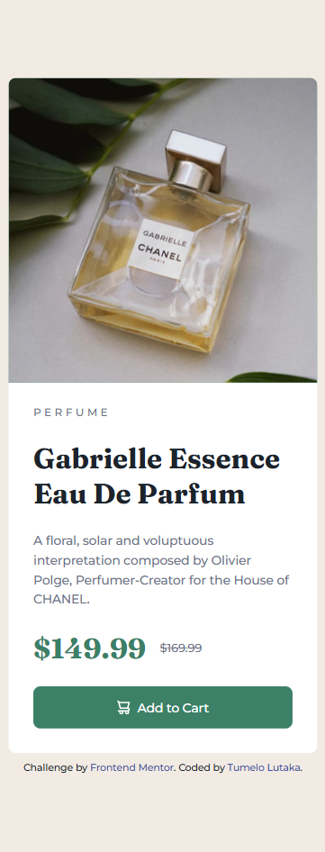
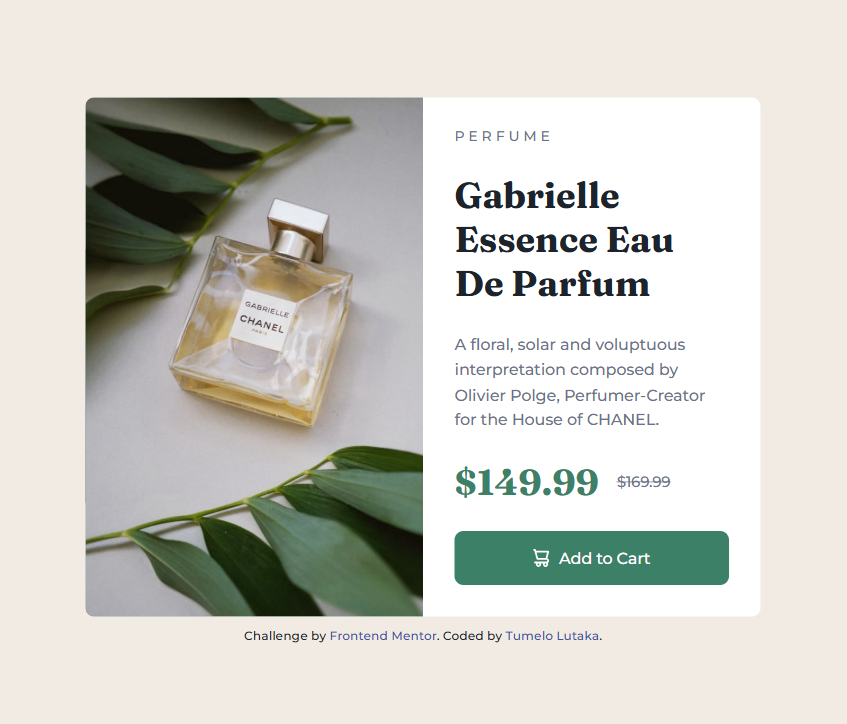
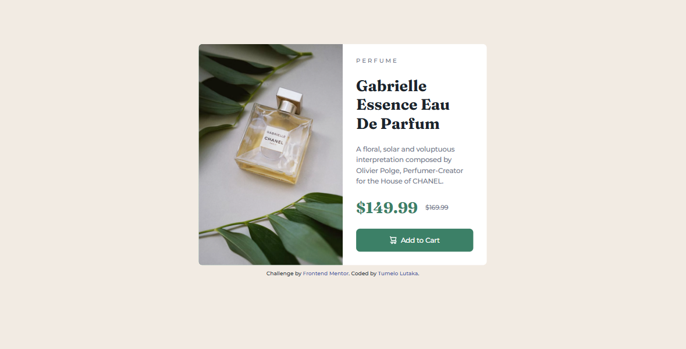

# Frontend Mentor - Product preview card component solution

This is a solution to the [Product preview card component challenge on Frontend Mentor](https://www.frontendmentor.io/challenges/product-preview-card-component-GO7UmttRfa). Frontend Mentor challenges help you improve your coding skills by building realistic projects.

## Table of contents

- [Overview](#overview)
  - [The challenge](#the-challenge)
  - [Screenshot](#screenshot)
  - [Links](#links)
- [My process](#my-process)
  - [Built with](#built-with)
  - [What I learned](#what-i-learned)
- [Author](#author)

**Note: Delete this note and update the table of contents based on what sections you keep.**

## Overview

### The challenge

Users should be able to:

- View the optimal layout depending on their device's screen size
- See hover and focus states for interactive elements

### Screenshot





### Links

- Solution URL: https://github.com/TumeloLutaka/product-preview-card-component
- Live Site URL: https://tumelolutaka.github.io/product-preview-card-component/

## My process

### Built with

- Semantic HTML5 markup
- CSS custom properties
- Flexbox
- CSS Grid
- Mobile-first workflow
- CSS Media Queries

### What I learned

In implementing this project I encountered a new problem case in needing to load two different images depending on the screensize in the same location. This problem and later research resulted in me gaining new knowledge on the HTML element <picture>. I am looking forward to applying this new knowledge in future projects to consolidate my understanding of this element.

```html
<picture>
  <source
    srcset="./images/image-product-desktop.jpg"
    media="(min-width:48em)"
  />
  <source srcset="./images/image-product-mobile.jpg" />
  
</picture>
```

## Author

- Frontend Mentor - [@TumeloLutaka](https://www.frontendmentor.io/profile/TumeloLutaka)
- Github - [@TumeloLutaka](https://github.com/TumeloLutaka)
